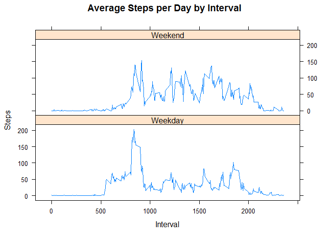

# Assignment1
Jonathan Marin  
April 6, 2017  


## Reading in the Activity Monitoring Data
1. Load the data (i.e. read.csv())


```r
activity = read.csv("activity.csv")
```


##Total Number of Steps by Day

1. Calculate the total number of steps taken per day
2. If you do not understand the difference between a histogram and a barplot, research the difference between them. Make a histogram of the total number of steps taken each day
3. Calculate and report the mean and median of the total number of steps taken per day


```r
stepsByDay = aggregate(steps ~ date, activity, sum)

hist(stepsByDay$steps, main = paste("Total Steps Each Day"), col="blue", xlab= "Number of Steps")
```

<!-- -->

```r
##Mean and Median
rmedian = median(stepsByDay$steps)
rmean = mean(stepsByDay$steps)
```

The mean is 1.0766189\times 10^{4} and the median is 10765. The mean is 1.0766189\times 10^{4} and the median is 10765. 


##Average Daily Pattern

1. Make a time series plot (i.e. type = "l") of the 5-minute interval (x-axis) and the average number of steps taken, averaged across all days (y-axis)
2. Which 5-minute interval, on average across all the days in the dataset, contains the maximum number of steps?


```r
step_interval = aggregate(steps ~ interval, activity, mean)

plot(step_interval$interval, step_interval$steps, type="l", xlab="Interval", ylab= "# of Steps", main = "Average # of Steps per Day by Interval")
```

<!-- -->

```r
max = step_interval[which.max(step_interval$steps),1]
```

The max interval, on average across all the days in the dataset is interval 835.


##Impute Missing Values

1. Calculate and report the total number of missing values in the dataset (i.e. the total number of rows with NAs)
2. Devise a strategy for filling in all of the missing values in the dataset. The strategy does not need to be sophisticated. For example, you could use the mean/median for that day, or the mean for that 5-minute interval, etc.
3. Create a new dataset that is equal to the original dataset but with the missing data filled in.
4. Make a histogram of the total number of steps taken each day and Calculate and report the mean and median total number of steps taken per day. Do these values differ from the estimates from the first part of the assignment? What is the impact of imputing missing data on the estimates of the total daily number of steps?

###My strategy for imputing data is to fill in zero for all days that don't have data.  It is being assumed that no steps were logged for NA intervals. I expect that now these intervals with zero data will now be included in the average and the averages for affected intervals will lower. 


```r
##loading sql library
library(sqldf)
```

```
## Loading required package: gsubfn
```

```
## Loading required package: proto
```

```
## Loading required package: RSQLite
```

```r
##counter number of null values in dataframe
MissingDataCount = sqldf("select count(*) from activity where steps is null")
```

```
## Loading required package: tcltk
```

```
## Warning: Quoted identifiers should have class SQL, use DBI::SQL() if the
## caller performs the quoting.
```

```r
##The number of missing values is the following:
MissingDataCount
```

```
##   count(*)
## 1     2304
```

```r
##create a new activity dataframe to manipulate
activity2 = activity

##update all null values with zero
missingDataFill = sqldf("select case when steps is null then '0' else steps end as steps, date, interval from activity2")

##aggregate the data
stepsByDay2 = aggregate(steps ~ date, missingDataFill, sum)

##create a new histogram with new values
hist(missingDataFill$steps, main = paste("Total Steps Each Day"), col="blue", xlab= "Number of Steps")
```

<!-- -->

```r
#calculate new median and mean
rmedian2 = median(missingDataFill$steps)
rmean2 = mean(missingDataFill$steps)
```

The median with imputted data is 0. 

The mean with imputted data is 32.4799636.

As expected, with zero values being calculated, the median and mean as decreased significantly. 

##Weekdays vs Weekends
1. Create a new factor variable in the dataset with two levels - "weekday" and "weekend" indicating whether a given date is a weekday or weekend day.
2. Make a panel plot containing a time series plot (i.e. type = "l") of the 5-minute interval (x-axis) and the average number of steps taken, averaged across all weekday days or weekend days (y-axis). See the README file in the GitHub repository to see an example of what this plot should look like using simulated data.


```r
##Created Vector of Weekdays
weekdays <- c("Monday", "Tuesday", "Wednesday", "Thursday", 
              "Friday")

##create new row on whether it is weekday or weekend
missingDataFill$dow = as.factor(ifelse(is.element(weekdays(as.Date(missingDataFill$date)),weekdays), "Weekday", "Weekend"))

##aggregate the daya
StepsbyDayOfWeek <- aggregate(steps ~ interval + dow, missingDataFill, mean)

##load library lattice
library(lattice)

##plot results
xyplot(StepsbyDayOfWeek$steps ~ StepsbyDayOfWeek$interval|StepsbyDayOfWeek$dow, main="Average Steps per Day by Interval",xlab="Interval", ylab="Steps",layout=c(1,2), type="l")
```

<!-- -->
For both the weekday and weekend dataset, there is little steps between intervals 0-500.  Steps seem to increase and spike significantly between 500-1000 on both Weekdays and Weekends.   After interval 1000 is where there is the most difference and Weekend behavior has more spikes of steps taken.  
